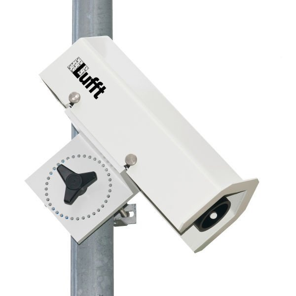

# SHM31 Snow Depth Sensor

This binding offers a complete driver implementation for an SHM31 connected via RS485 half-duplex using Modbus RTU.


## Documentation

* Manual: https://www.lufft.com/download/manual-lufft-shm31-en/


## Wiring

Ensure the device is connected to a serial port on the board using RS485 half-duplex.
**Note:** this is dependent on the board, so we only list the colours used by the supplied interface cable and the corrosponding pins on the sensor connector.
RS485_A = Green (sensor connector pin 5).
RS485_B = Yellow (sensor connector pin 2).
RS485_GND = Grey (sensor connector pin 4) - Not required.
HEATING_TRIGGER = Red (sensor connector pin 3) - Not required.
VDC_IN_+ (12 or 24) = Brown (sensor connector pin 8).
VDC__IN_- (0) = White (sensor connector pin 7).

## Usage

* Ensure the device is configured to Modbus RTU using UMB ConfigTool.NET.


```csharp

```


## Limitations

* Modbus RTU using RS485 half-duplex is the only supported implementation.
* Polling should only be attempted at 1 second intervals or above.
